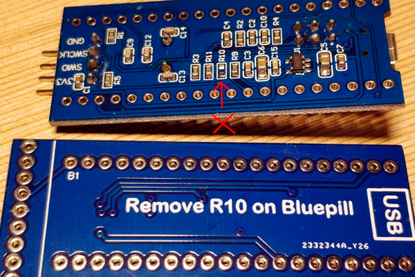
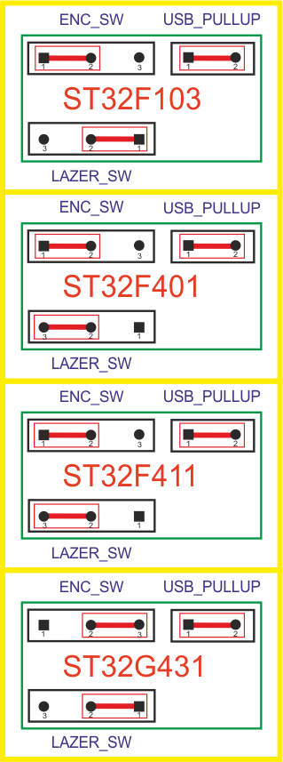

# LPP MainBoard Gen-1 (Ver. 5)

⚠️ **Статус проекта:**  
Разводка завершена, плата собрана и успешно прошла первичную проверку.  
Все найденные ошибки исправлены в текущей ревизии.  
Проект продолжает развиваться — по мере тестирования и улучшений возможны обновления.

---

## 📑 Содержание

- [Главная плата](#-главная-плата)
- [Поддерживаемые MCU](#-поддерживаемые-модули-mcu)
- [Файлы проекта](#-файлы-проекта-diptrace)
- [Распиновка Blue Pill](#распиновка-платы-blue-pill-stm32f103c8t6)
- [Таблица сигналов](#-основная-сводная-таблица-сигналов)
- [Таблица пинов](#-таблица-пинов-140)
- [Разъёмы управления (DB25)](#db25--разъёмы-управления-осями)
- [Номиналы компонентов](#номиналы-для-платы-lpp_mainboard_gen_1_ver_5)
- [Ссылки](#-ссылки-и-ресурсы)

---

## 📘 Главная плата

Первая рабочая версия основной платы LPP-Laser.  
Плата функционирует корректно; по мере дальнейшей эксплуатации и расширения функционала будет постепенно обновляться и улучшаться.

1. Все контрольные точки выведены для удобной отладки и измерений.

2. Трассировка USB выполнена по всем правилам «по феншую»:  
   дифференциальная пара согласована, импеданс выдержан, длины и симметрия соблюдены.  
   При пересечении сигнальных линий с другой стороны платы дорожки проходят **только под углом 90°**,  
   что минимизирует взаимные наводки и сохраняет целостность дифференциального сигнала.

3. Все разъёмы и не-SMD элементы припаиваются со стороны низа платы.  
   Если сверху видны соединения — это заливка (GND), паять её не нужно.

4. Минимальное расстояние между проводниками — **0.3 мм**.

5. Плату можно изготавливать **без металлизации отверстий** — достаточно пропаять только переходные отверстия вручную (соединяя верх и низ).

6. Подключение каретки — через **FFC-шлейф 24 пин, шаг 1 мм**.

---

# 🔌 Поддерживаемые модули MCU

Плата рассчитана на установку трёх типов модулей:

- **Blue Pill (STM32F103)**
- **Black Pill (STM32F401)**
- **Black Pill (STM32F411)**
- **Green Pill (STM32G431)**

---

### Важно для USB

Для **любого контроллера**, чтобы USB гарантированно работал, необходимо:

- Соединить **PA8** USB_EN с **PA12** USB_DP через резистор **1.5 кОм**.

Это позволит микроконтроллеру программно управлять подключением USB и корректно инициировать подключение к компьютеру.

---

### Особенность для Blue Pill (STM32F103)

**Если используется Blue Pill (STM32F103), потребуется паяльник:**

- Выпаять резистор **R10** с платы Blue Pill.

Это необходимо, чтобы встроенная подтяжка USB не мешала программному управлению подключением.



Все модули устанавливаются в один общий разъём,  
тип модуля выбирается с помощью пары **перемычек конфигурации**.

**Схема расположения джамперов на плате LPP MainBoard**




---

# 📂 Файлы проекта (DipTrace)

### *.dip — платы
- **LPP_MainBoard_Gen_1_Ver_5.dip** — основная плата управления.
- **LPP_Carriage_Module_Gen_1_Ver_2.dip** — рабочая версия.

### *.dch — схемы
- **LPP_MainBoard_Gen_1_Ver_5.dch**
- **LPP_Carriage_Module_Gen_1_Ver_2.dch**


---

# Распиновка платы Blue Pill (STM32F103C8T6)

Ориентация платы:
- Смотрите **сверху на плату**, надпись `STM32F103C8T6` читается прямо.
- **USB-разъём — слева**, **SWD-разъём — справа**.
- На плате два ряда по 20 контактов.
- **Нижний ряд** (ряд ближе к краю платы) нумеруется **слева направо — от USB к SWD:** пины **1–20**.
- **Верхний ряд** (ряд ближе к микроконтроллеру) нумеруется **справа налево — от SWD к USB:** пины **21–40**.
- Таким образом, нумерация повторяет **направление ножек корпуса STM32 (против часовой стрелки)**.

---

# 📊 Основная сводная таблица сигналов  
## (относительно Blue Pill STM32F103 → для STM32F411 и STM32G431)

```
№  | Сигнал        | F103 | F411 | G431 | Перенос на F411     | Перенос на F431   | Комментарий
---|---------------|------|------|------|---------------------|-------------------|-----------------------------
22 | E_STOP        | PB9  | PB9  | PB9  | Совпадает 1:1       | Совпадает 1:1     | 5 V tolerant
13 | PROBE         | PB7  | PB7  | PB7  | Совпадает 1:1       | Совпадает 1:1     | 5 V tolerant

25 | PWM_LASER     | PA0  | NRST | PA0  | На F411 = NRST      | Совпадает 1:1     |
26 | PWM_LED       | PA1  | PA0  | PA1  | Перенос PA1 → PA0   | Совпадает 1:1     |
27 | REZERV        | PA2  | PA1  | PA2  | Перекл на PWM_LASER | Совпадает 1:1     |
28 | REZERV        | PA3  | PA2  | PA3  | REZERV              | REZERV            |
29 | REZERV        | PA4  | PA3  | PA4  | REZERV              | REZERV            |

14 | X_ENC_A       | PB6  | PB6  | PB6  | Совпадает 1:1       | Совпадает 1:1     | 5 V tolerant
16 | X_ENC_B       | PB8  | PB8  | PB5  | Совпадает 1:1       | Перекл на X_ENC_B |  ⚠ На 431 BOOT0 PB8. 5 V tolerant

 4 | X_MO_ENA      | PB15 | PB15 | PB15 | Совпадает 1:1       | Совпадает 1:1     |
 2 | X_MO_R        | PB13 | PB13 | PB13 | Совпадает 1:1       | Совпадает 1:1     |
 3 | X_MO_L        | PB14 | PB14 | PB14 | Совпадает 1:1       | Совпадает 1:1     |

 1 | X_EN          | PB12 | PB12 | PB12 | Совпадает 1:1       | Совпадает 1:1      |
35 | X_STEP        | PB10 | PB1  | PB2  | Перенос PB10→PB1    | Перенос PB10→PB2   |
36 | X_DIR         | PB11 | PB2  | PB10 | Перенос PB11→PB2    | Перенос PB11→PB1   |

32 | Y_EN          | PA7  | PA6  | PA7  | Перенос PA7→PA6     | Совпадает          |
33 | Y_STEP        | PB0  | PA7  | PB0  | PB0→PA7             | Совпадает          |
34 | Y_DIR         | PB1  | PB0  | PB1  | PB1→PB0             | Совпадает          |

31 | Z_EN          | PA6  | PA5  | PA6  | Перенос PA6→PA5     | Совпадает          |
 6 | Z_STEP        | PA9  | PA9  | PA9  | Совпадает 1:1       | Совпадает 1:1      |
 7 | Z_DIR         | PA10 | PA10 | PA10 | Совпадает 1:1       | Совпадает 1:1      |

 5 | USB_EN        | PA8  | PA8  | PA8  | Совпадает 1:1       | Совпадает 1:1      |
 8 | USB_DM        | PA11 | PA11 | PA11 | Совпадает 1:1       | Совпадает 1:1      |
 9 | USB_DP        | PA12 | PA12 | PA12 | Совпадает 1:1       | Совпадает 1:1      |

18 | 5V            | 5V   | 5V   | 5V   | Совпадает 1:1       | Совпадает 1:1      |
19 | GND           | GND  | GND  | GND  | Совпадает 1:1       | Совпадает 1:1      |
```

---

# 🟩 Свободные пины

```
№   | F103 | F411 | G431 | Комментарий
----|------|------|------|-----------------
10  | PA15 | PA15 | PA15 | GPIO / JTDI
11  | PB3  | PB3  | PB3  | GPIO / SWO
12  | PB4  | PB4  | PB4  | GPIO / NJTRST
22  | PC13 | PC13 | PC13 | GPIO / Выведен как CP контрольная точка
```

---

# 🧩 Служебные и системные пины (отладка, загрузка, системные и кварцевые линии)

```
-----------------------------------------------------------------------------------------------------------------------------------------------------
Назначение              | № пина       | STM32F103          | STM32F411           | STM32G431          | Комментарий
------------------------|--------------|--------------------|---------------------|--------------------|---------------------------------------------
VBAT                    | 21           | ✅ (VBAT)          | ✅ (VBAT)          | ✅ (VBAT)          | Питание RTC / резервное питание
NRST (Reset)            | 37 / 25 / 38 | ✅ №37 = NRST      | ✅ NRST на №25,    | ✅ NRST на №38     | На разъёме: F103→37, F411→25, G431→38
BOOT0                   | —            | ✅ Есть на корпусе | ✅ Есть на корпусе | PB8                | Аппаратная линия загрузчика BOOT0 на G431
PB2 – BOOT1             | —            | ✅ Есть            | 🚫 Нет             | 🚫 Нет             | В новых сериях BOOT1 убран, используется только BOOT0
PA13 – SWDIO / JTMS     | — (корпус МК)| ✅ Есть            | ✅ Есть            | ✅ Есть            | Интерфейс SWD (данные), не трогать при отладке/прошивке
PA14 – SWCLK / JTCK     | — (корпус МК)| ✅ Есть            | ✅ Есть            | ✅ Есть            | Интерфейс SWD (такты), не трогать
PA15 – JTDI             | 10           | ✅ PA15            | ✅ PA15            | ✅ PA15            | Можно как GPIO после отключения JTAG (AFIO/SYSCFG)
PB3  – JTDO / TRACESWO  | 11           | ✅ PB3             | ✅ PB3             | ✅ PB3             | SWO/JTAG; можно как GPIO при отключении JTAG
PB4  – NJTRST           | 12           | ✅ PB4             | ✅ PB4             | ✅ PB4             | JTAG reset, при чистом SWD не нужен
PC14 – OSC32_IN (LSE)   | 23           | ✅ PC14            | ✅ PC14            | ✅ PC14            | Вход низкочастотного кварца 32.768 кГц
PC15 – OSC32_OUT (LSE)  | 24           | ✅ PC15            | ✅ PC15            | ✅ PC15            | Выход низкочастотного кварца 32.768 кГц
HSE_IN (OSC_IN)         | —            | ✅ Есть на корпусе | ✅ Есть на корпусе | ✅ Есть на корпусе | Ноги HSE не на разъёме 1–40, только у кристалла
HSE_OUT (OSC_OUT)       | —            | ✅ Есть на корпусе | ✅ Есть на корпусе | ✅ Есть на корпусе | То же, кварц 8 МГц только возле МК
3.3V                    | 20           | ✅ №20 = 3.3V      | ✅ №20 = 3.3V      | ✅ №20 = 3.3V      | Основное питание 3.3 В
3.3V (доп. вывод)       | 38 / 39      | ✅ №38 = 3.3V      | ✅ №38 = 3.3V      | ✅ №39 = 3.3V      | F103/F411: 3.3В на 38; G431: 3.3В на 39
5V                      | 18 / 40      | ✅ №18 = 5V        | ✅ №18 и №40 = 5V  | ✅ №18 = 5V        | F411 дополнительно имеет 5В на 40, у F103/G431 там GND
GND                     | 19 / 39 / 40 | ✅ 19,39,40 = GND  | ✅ 19,39 = GND     | ✅ 19,40 = GND     | F103: 3 земли; F411: GND только 19,39; G431: GND 19 и 40
-----------------------------------------------------------------------------------------------------------------------------------------------------
```

---

# 📘 Таблица пинов (1–40)  
## Blue Pill → Black Pill → STM32G431

```
№  | Blue Pill | Black Pill  | STM32G431  | F103↔F411 | F103↔G431
---|-----------|-------------|------------|-----------|-----------
1  | PB12      | PB12        | PB12       | Да        | Да
2  | PB13      | PB13        | PB13       | Да        | Да
3  | PB14      | PB14        | PB14       | Да        | Да
4  | PB15      | PB15        | PB15       | Да        | Да
5  | PA8       | PA8         | PA8        | Да        | Да
6  | PA9       | PA9         | PA9        | Да        | Да
7  | PA10      | PA10        | PA10       | Да        | Да
8  | PA11      | PA11        | PA11       | Да        | Да
9  | PA12      | PA12        | PA12       | Да        | Да
10 | PA15      | PA15        | PA15       | Да        | Да
11 | PB3       | PB3         | PB3        | Да        | Да
12 | PB4       | PB4         | PB4        | Да        | Да
13 | PB5       | PB5         | PB5        | Да        | Да
14 | PB6       | PB6         | PB6        | Да        | Да
15 | PB7       | PB7         | PB7        | Да        | Да
16 | PB8       | PB8         | PB8        | Да        | Да
17 | PB9       | PB9         | PB9        | Да        | Да
18 | 5V        | 5V          | 5V         | Да        | Да
19 | GND       | GND         | GND        | Да        | Да
20 | 3.3V      | 3.3V        | 3.3V       | Да        | Да
21 | VBAT      | VBAT        | VBAT       | Да        | Да
22 | PC13      | PC13        | PC13       | Да        | Да
23 | PC14      | PC14        | PC14       | Да        | Да
24 | PC15      | PC15        | PC15       | Да        | Да
25 | PA0       | NRST        | PA0        | Нет       | Да
26 | PA1       | PA0         | PA1        | Нет       | Да
27 | PA2       | PA1         | PA2        | Нет       | Да
28 | PA3       | PA2         | PA3        | Нет       | Да
29 | PA4       | PA3         | PA4        | Нет       | Да
30 | PA5       | PA4         | PA5        | Нет       | Да
31 | PA6       | PA5         | PA6        | Нет       | Да
32 | PA7       | PA6         | PA7        | Нет       | Да
33 | PB0       | PA7         | PB0        | Нет       | Да
34 | PB1       | PB0         | PB1        | Нет       | Да
35 | PB10      | PB1         | PB2        | Нет       | Нет
36 | PB11      | PB2         | PB10       | Нет       | Нет
37 | NRST      | PB10        | PB11       | Нет       | Нет
38 | 3.3V      | 3.3V        | NRST       | Да        | Нет
39 | GND       | GND         | 3.3V       | Да        | Нет
40 | GND       | 5V          | GND        | Нет       | Да
```

---

# DB25 — разъёмы управления осями

## DB25 (Мама, вид спереди)

```
 \ 13 12 11 10  9  8  7  6  5  4  3  2  1 /
  \ 25 24 23 22 21 20 19 18 17 16 15 14  /
   ------------------------------------
```

## DB25 (Папа, вид спереди)

```
  \ 1  2  3  4  5  6  7  8  9 10 11 12 13 /
   \ 14 15 16 17 18 19 20 21 22 23 24 25 /
    -------------------------------------
```

---

## Распиновка DB25

```
Пин | Назначение
----|-----------------
 2  | X_STEP
 3  | X_DIR
 4  | X_ENABLE

 5  | Y_STEP
 6  | Y_DIR
 7  | Y_ENABLE

 8  | Z_STEP
 9  | Z_DIR
 17  | Z_ENABLE
 
 15  | PROBE
 13  | E_STOP
```

---

# Номиналы для платы LPP_MainBoard_Gen_1_Ver_5

## Резисторы
- SMD — Резисторы, посадочные места универсальные **0805 / 1206**
- Все подтягивающие без номинала, номинал: **1…10 кОм**

## Конденсаторы
- SMD — Кондесаторы, посадочные места универсальные **0805 / 1206**
- SMD — Кондесаторы, все без номинала, номинал: **0.1 мкФ**
- Тантал низковольтный (2 шт, от 6 В): **10 мкФ и выше**
- Электролит низковольтный (2 шт, от 6 В): **100 мкФ и выше**
- Электролит высоковольтный (1 шт, от 24 В): **1000 мкФ и выше**

## USB Хаб 
- FE1.1S — смотрите даташит. Там нужен всего один резистор 2,7 кОм и пара конденсаторов для фильтрации питания. Подойдут практически любые.

## Мосты двигателя
(можно не ставить, если ось X — шаговик или BLDC)

- **BTN7933** — 18 В / 43 А  
- **IFX007T** — 38 В / 55 А  

### Совместимые аналоги (один корпус и пин-аут — TO-263-7)

**Infineon NovalithIC™ семейство (полная совместимость по корпусу и ножкам):**

- **BTS7960 / BTS7960B** — классика (устаревает)
- **BTN7930B / BTN7933B** — 18 В / ~43 А
- **BTN7960B / BTN7960TA**
- **BTN7970B / BTN7971B**
- **BTN8960TA / BTN8962TA**
- **BTN8980TA / BTN8982TA** ← **рекомендуется** (лучшая современная версия)
- **IFX007T** — 38 В / 55 А (самый мощный в линейке)

**Все перечисленные микросхемы имеют одинаковый корпус PG-TO263-7 и полностью совместимы по расположению ножек.**  
Можно ставить вместо друг друга без изменения разводки платы.

### Краткое сравнение
- **BTN7933B** — 18 В / 43 А  
- **IFX007T** — **38 В / 55 А** (мощнее по току и напряжению)

**Вывод:**  
Для большинства задач отлично подойдёт **BTN8982TA** или **IFX007T**.  
IFX007T заметно мощнее, если нужен запас по току и напряжению.

### Резистор SR (slew-rate)
Управляет скоростью переключения силовых транзисторов.

- Меньше сопротивление → быстрые фронты → больше помех  
- Больше сопротивление → мягкие фронты → меньше шумов

Рекомендовано:
- **0 Ω** — максимальная скорость, много помех  
- **5.1 kΩ** — оптимальный вариант (рекомендация Infineon)  
- **51 kΩ** — минимальные помехи, самые мягкие фронты  

## Драйвер MOSFET лазера непосредственно на каретке

- Транзистор напрямую управляется с выхода контроллера.  
  На затворе установлен токоограничивающий резистор, чтобы не нагружать выход контроллера ёмкостью затвора.

- Для большинства логических MOSFET этого достаточно и схема работает напрямую.

- Я рекомендую установить драйвер **MAX15070**  
  и запитать его непосредственно от питания лазера (**4–14 В**).  
  Всё просто.

### MAX15070

Отличный MOSFET-драйвер от Maxim:
- Питание от **4 В** до **14 В**
- До **7 А sink**, **3 А source**
- Логический вход: TTL/CMOS (~0.8 В LOW / ~2 В HIGH)
- Корпус: **SOT-23**
- Фронты: **примерно 5–10 нс** при ёмкости в нагрузке **1 нФ**
- Matched delay между входами: **500 пс**
- Защита от shoot-through встроена

---

# 🔗 Ссылки и ресурсы

LPP-Laser (Linear Path Platform — Laser Edition) — открытая платформа с открытым исходным кодом: SDK, ПО и прошивки для лазерной засветки фотошаблонов печатных плат.  
Скачать новые версии: https://t.me/LPP_Printer  
Обсудить и задать вопросы: https://t.me/LPP_Printer_Chat  
Исходники SDK и прошивки: https://github.com/DimaFantasy/LPP  
Исходники DLL Excellon Gerber → Image: https://github.com/DimaFantasy/gerb2img  
Все PCB-файлы проекта доступны в репозитории: https://github.com/DimaFantasy/LPP/tree/main/PCB