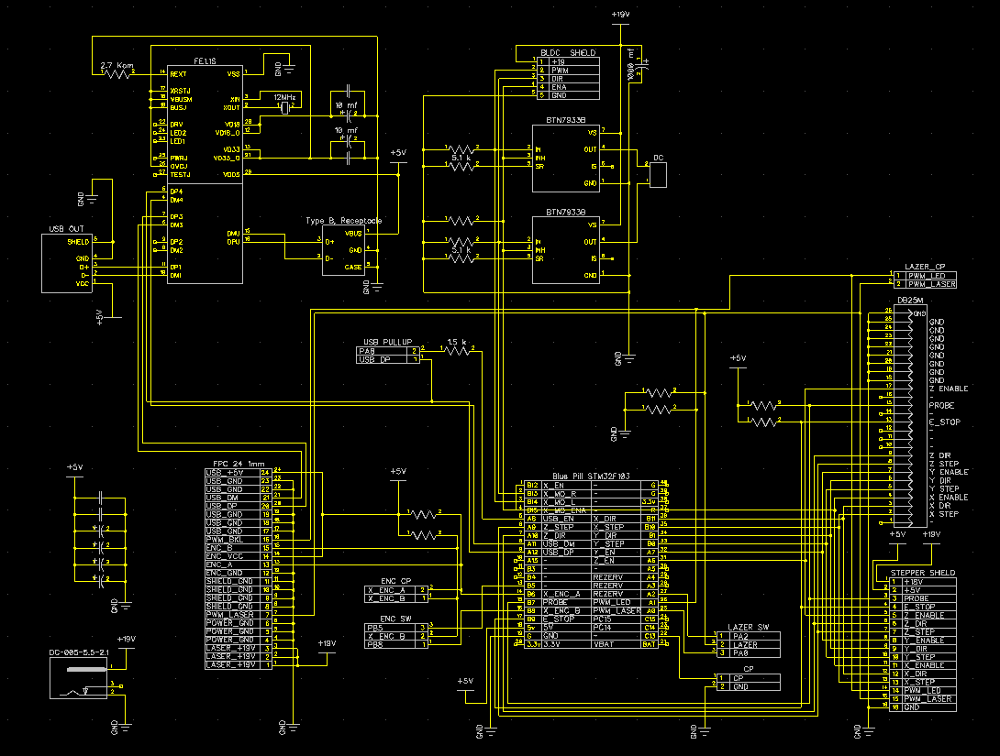

# 🖨️ LPP-Laser — SDK лазерного принтера

**LPP-Laser (Linear Path Platform — Laser Edition)** — это SDK для управления и разработки встроенного программного обеспечения **лазерного принтера**, предназначенного для **печати фотошаблонов печатных плат**.  
Проект ориентирован на микроконтроллеры **STM32** (Blue Pill, Black Pill, G4).  

Добро пожаловать в проект!

**Быстрые ссылки:** [🔌 Схема подключения](#-схема-подключения-wiring-diagram) · [📜 Лицензия (GNU GPLv3)](./LICENSE)

---

## 📑 Содержание

- [Загрузка](#-загрузка)
- [Схема подключения (Wiring Diagram)](#-схема-подключения-wiring-diagram)
- [Печатные платы и схемы](#-печатные-платы-и-схемы)
- [USB-идентификаторы](#-usb-идентификаторы)
- [SDK и исходники](#-sdk-и-исходники)
- [Сообщество](#-сообщество)
- [Лицензия](#-лицензия)

---

## 📦 Загрузка

**Последняя версия управляющей программы** доступна в официальном Telegram-канале:  
👉 [https://t.me/LPP_Printer](https://t.me/LPP_Printer)

---

## 🔌 Схема подключения (Wiring Diagram)

Общая схема подключения устройства находится в корне репозитория: **[schematic.png](./schematic.png)**.



Подробное описание пинов и сигналов каждой платы — в [PCB/README.md](./PCB/README.md).

---

## 📦 Печатные платы и схемы

Все PCB-файлы проекта находятся в папке **[PCB](./PCB)** этого проекта.

| Описание | Ссылка |
|----------|--------|
| **Схема подключения (Wiring Diagram)** | [schematic.png](./schematic.png) |
| **Основная плата (MainBoard)** | Папка PCB |
| **Описание пинов и сигналов** | [PCB/README.md](./PCB/README.md) |
| **Поддерживаемые MCU** | STM32F103, STM32F401, STM32F411, STM32G431 |

**Возможности:**
- В папке **PCB** находится **основная плата (MainBoard)**, в которую можно подключить любой модуль «пилы» (Blue/Black/Green Pill).  
- Присутствует подробное **описание пинов всех плат**, включая назначение сигналов, питание и подключения периферии.  
- Даны **описания используемых чипов**, их параметры и примеры применения.  
- Вся информация позволяет создать **управляющую плату для каретки** и собрать механическую часть лазерного принтера.

---

## 🔖 USB-идентификаторы

Устройство определяется как USB Custom HID. Идентификаторы зарегистрированы на [pid.codes](https://pid.codes/1209/573C/).

| Параметр | Значение |
|----------|----------|
| VID | `0x1209` (pid.codes) |
| PID | `0x573C` (LPP — Linear Path Platform) |
| VID:PID | `1209:573C` |

Проверка подключения:

```bash
# Linux / macOS
lsusb | grep -i 1209:573c
```

```powershell
# Windows, PowerShell
Get-PnpDevice -PresentOnly | Where-Object { $_.InstanceId -like '*VID_1209&PID_573C*' }
```

```bat
:: Windows, командная строка
pnputil /enum-devices /connected | findstr /i "VID_1209&PID_573C"
```

Вручную: «Диспетчер устройств» → свойства устройства → «ИД оборудования» → `USB\VID_1209&PID_573C`.

---

## 🛠️ SDK и исходники

| Параметр | Значение |
|----------|----------|
| **Размер SDK** | ~152 КБ |
| **Количество файлов** | 9 файлов |
| **Изменяемые файлы** | `main.c`, `usbd_custom_hid_if.c`, `.ioc` |

### Основное приложение (App)

**Конфигурация в Keil 5:**
- **Адрес начала:** `0x08000000`  
- **Размер:** `0x7FE8` (**32 КБ**, без версии и сигнатуры)  

**Реализация:**
- Необходимо реализовать примерно **несколько функций**, включая:  
  - управление пинами,  
  - инициализацию таймера,  
  - старт/остановку DMA,  
  - передачу данных HID.  
- В исходниках приведены **подробные примеры использования функций и их документация**.

### Bootloader (Boot)

**Конфигурация в Keil 5:**
- **Адрес начала:** `0x08008000`  
- **Размер:** `0x7FE8` (**32 КБ**)  

**Реализация:**
- Необходимо реализовать только **2 функции**:  
  - обработка пакетов с HID,  
  - отправка пакетов в HID.  
- Основная задача бутлоадера — **прошить основное приложение**.  
- В исходниках приведены **подробные примеры использования функций и их документация**.

---

## 💬 Сообщество

Обсудить проект, задать вопросы или поделиться опытом можно в Telegram-группе:  
👉 [https://t.me/LPP_Printer_Chat](https://t.me/LPP_Printer_Chat)

---

## 📜 Лицензия

Проект распространяется на условиях открытой лицензии **GNU GPLv3**.  
Полный текст лицензии находится в файле **[LICENSE](./LICENSE)** в корне репозитория.
